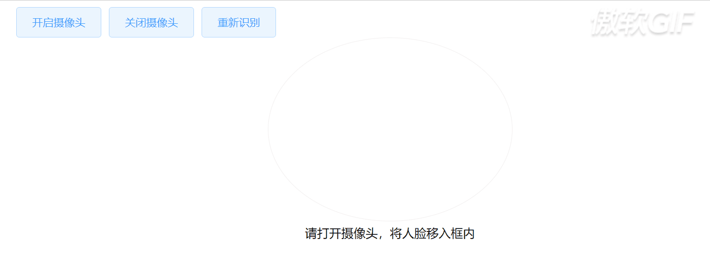

## 说明
- 提供 PC 端人脸识别功能。
- 基于uniapp，提供 H5 和 微信端人脸识别功能。

## 引入
略

## PC端
+ <strong>参数：</strong>
  - <strong>backType：</strong> String，默认值：'base64'
    - 返回结果类型  'file' | 'base64'
  - <strong>succTips：</strong> String
    - 识别成功，提示语
+ <strong>方法：</strong>
  - <strong>init：</strong> Function
    - 初始化摄像头，开启人脸识别
  - <strong>exit：</strong> Function
    - 关闭摄像头，取消监听
  - <strong>updateFace：</strong> Function
    - 重新识别
  - <strong>reset：</strong> Function
    - 对组件进行重置
+ <strong>事件：</strong>
  - <strong>faceCode：</strong> Function
    - 识别结果回调事件
> 浏览器出于安全性的考虑，现只支持 HTTPS 协议 和 localhost 下，调用摄像头。HTTP 协议下是无法调用摄像头的。如果一定要在 HTTP下调用到摄像头，只能修改 浏览器的配置项，但不建议这么做。  
Chrome修改：chrome://flags/#unsafely-treat-insecure-origin-as-secure  --  enable   --   重启浏览器  
其他浏览器，修改浏览器前缀即可。
+ <strong>使用示例：</strong>
```html
<veriface
  ref="faceLogin"
  @faceCode="faceCode"
  :backType="backType"
  :succTips="succTips">
</veriface>
```
```javascript
export default {
  data() {
    return {
      backType: "file",
      succTips: "识别成功，登录中..."
    }
  },
  mounted() {
    this.$refs.faceLogin.init();
  },
  beforeDestroy() {
    if(this.$refs.faceLogin) {
      this.$refs.faceLogin.exit();
    }
  },
  methods: {
    faceCode(res) {
      // res为识别成功后，返回结果
    }
  }
}
```
+ <strong>演示效果：</strong>

<!DOCTYPE html>
<html>
  <head>
    <style>
      .img-content {
        width: 100%;
        overflow: hidden;
        position: relative;
      }
      .img-content .list-demo-img {
        width: 100%; 
        height: auto; 
        margin-top: 5px; 
        max-width: unset;
      }
      .img-content::before {
        content: "";
        position: absolute;
        right: 16px;
        top: 6px;
        width: 130px;
        height: 50px;
        background: #fff;
      }
    </style>
  </head>
  <body>
    <div class="img-content">
      
    </div>
  </body>
</html>
## 移动端
> 待补充
